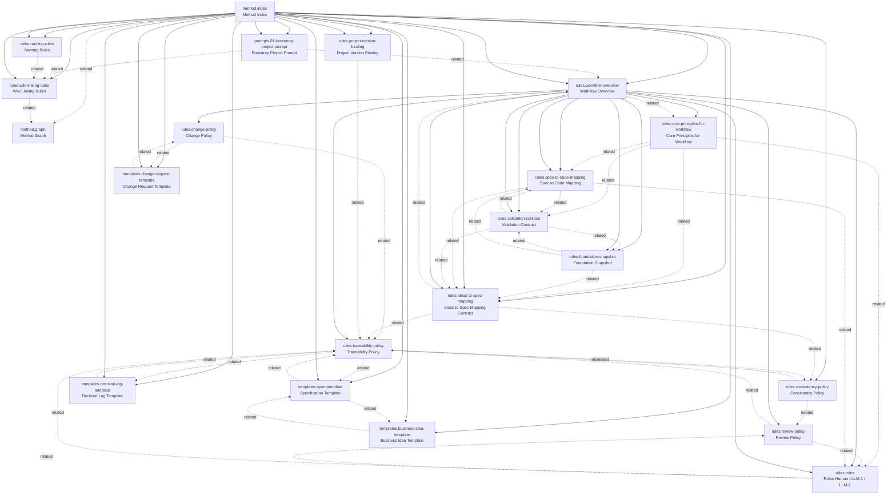

# Method Graph

Generated from YAML front matter. Do not edit graph edges manually.

```mermaid
graph TD
  method_graph["method.graph<br/>Method Graph"]
  method_index["method.index<br/>Method Index"]
  prompts_01_bootstrap_project_prompt["prompts.01-bootstrap-project.prompt<br/>Bootstrap Project Prompt"]
  rules_change_policy["rules.change-policy<br/>Change Policy"]
  rules_consistency_policy["rules.consistency-policy<br/>Consistency Policy"]
  rules_core_principles_for_workflow["rules.core-principles-for-workflow<br/>Core Principles for Workflow"]
  rules_foundation_snapshot["rules.foundation-snapshot<br/>Foundation Snapshot"]
  rules_ideas_to_spec_mapping["rules.ideas-to-spec-mapping<br/>Ideas to Spec Mapping Contract"]
  rules_naming_rules["rules.naming-rules<br/>Naming Rules"]
  rules_project_version_binding["rules.project-version-binding<br/>Project Version Binding"]
  rules_review_policy["rules.review-policy<br/>Review Policy"]
  rules_roles["rules.roles<br/>Roles Human / LLM-1 / LLM-2"]
  rules_spec_to_code_mapping["rules.spec-to-code-mapping<br/>Spec to Code Mapping"]
  rules_traceability_policy["rules.traceability-policy<br/>Traceability Policy"]
  rules_validation_contract["rules.validation-contract<br/>Validation Contract"]
  rules_wiki_linking_rules["rules.wiki-linking-rules<br/>Wiki Linking Rules"]
  rules_workflow_overview["rules.workflow-overview<br/>Workflow Overview"]
  templates_business_idea_template["templates.business-idea-template<br/>Business Idea Template"]
  templates_change_request_template["templates.change-request-template<br/>Change Request Template"]
  templates_decision_log_template["templates.decision-log-template<br/>Decision Log Template"]
  templates_spec_template["templates.spec-template<br/>Specification Template"]

  method_index --> rules_workflow_overview
  method_index --> rules_ideas_to_spec_mapping
  method_index --> rules_wiki_linking_rules
  method_index --> rules_naming_rules
  method_index --> rules_project_version_binding
  method_index --> templates_business_idea_template
  method_index --> templates_spec_template
  method_index --> templates_decision_log_template
  method_index --> templates_change_request_template
  method_index --> prompts_01_bootstrap_project_prompt
  method_index -. related .-> method_graph
  method_index --> prompts_01_bootstrap_project_prompt
  prompts_01_bootstrap_project_prompt -. related .-> rules_workflow_overview
  prompts_01_bootstrap_project_prompt -. related .-> rules_wiki_linking_rules
  rules_workflow_overview --> rules_change_policy
  rules_change_policy -. related .-> templates_change_request_template
  rules_change_policy -. related .-> rules_traceability_policy
  method_index --> rules_consistency_policy
  rules_consistency_policy -. related .-> rules_traceability_policy
  rules_consistency_policy -. related .-> rules_review_policy
  rules_workflow_overview --> rules_core_principles_for_workflow
  rules_core_principles_for_workflow -. related .-> rules_roles
  rules_core_principles_for_workflow -. related .-> rules_ideas_to_spec_mapping
  rules_core_principles_for_workflow -. related .-> rules_spec_to_code_mapping
  rules_core_principles_for_workflow -. related .-> rules_validation_contract
  rules_workflow_overview --> rules_foundation_snapshot
  rules_foundation_snapshot -. related .-> rules_validation_contract
  rules_foundation_snapshot -. related .-> rules_spec_to_code_mapping
  rules_foundation_snapshot -. related .-> rules_ideas_to_spec_mapping
  method_index --> rules_ideas_to_spec_mapping
  rules_ideas_to_spec_mapping -. related .-> rules_workflow_overview
  rules_ideas_to_spec_mapping -. related .-> rules_traceability_policy
  rules_ideas_to_spec_mapping -. related .-> rules_consistency_policy
  method_index --> rules_naming_rules
  rules_naming_rules -. related .-> rules_wiki_linking_rules
  method_index --> rules_project_version_binding
  rules_project_version_binding -. related .-> rules_traceability_policy
  rules_workflow_overview --> rules_review_policy
  rules_review_policy -. related .-> rules_roles
  rules_review_policy -. related .-> rules_traceability_policy
  rules_workflow_overview --> rules_roles
  rules_roles -. related .-> rules_traceability_policy
  rules_roles -. related .-> rules_review_policy
  rules_workflow_overview --> rules_spec_to_code_mapping
  rules_spec_to_code_mapping -. related .-> rules_validation_contract
  rules_spec_to_code_mapping -. related .-> rules_ideas_to_spec_mapping
  rules_spec_to_code_mapping -. related .-> rules_roles
  rules_workflow_overview --> rules_traceability_policy
  rules_traceability_policy -. related .-> rules_consistency_policy
  rules_traceability_policy -. related .-> templates_spec_template
  rules_traceability_policy -. related .-> templates_decision_log_template
  rules_workflow_overview --> rules_validation_contract
  rules_validation_contract -. related .-> rules_spec_to_code_mapping
  rules_validation_contract -. related .-> rules_ideas_to_spec_mapping
  rules_validation_contract -. related .-> rules_foundation_snapshot
  method_index --> rules_wiki_linking_rules
  rules_wiki_linking_rules -. related .-> method_graph
  method_index --> rules_workflow_overview
  rules_workflow_overview --> rules_roles
  rules_workflow_overview --> rules_ideas_to_spec_mapping
  rules_workflow_overview --> rules_spec_to_code_mapping
  rules_workflow_overview --> rules_validation_contract
  rules_workflow_overview --> rules_foundation_snapshot
  rules_workflow_overview -. related .-> rules_core_principles_for_workflow
  method_index --> templates_business_idea_template
  templates_business_idea_template -. related .-> templates_spec_template
  method_index --> templates_change_request_template
  templates_change_request_template -. related .-> rules_change_policy
  method_index --> templates_decision_log_template
  templates_decision_log_template -. related .-> rules_traceability_policy
  method_index --> templates_spec_template
  templates_spec_template -. related .-> templates_business_idea_template
  templates_spec_template -. related .-> rules_traceability_policy
```
